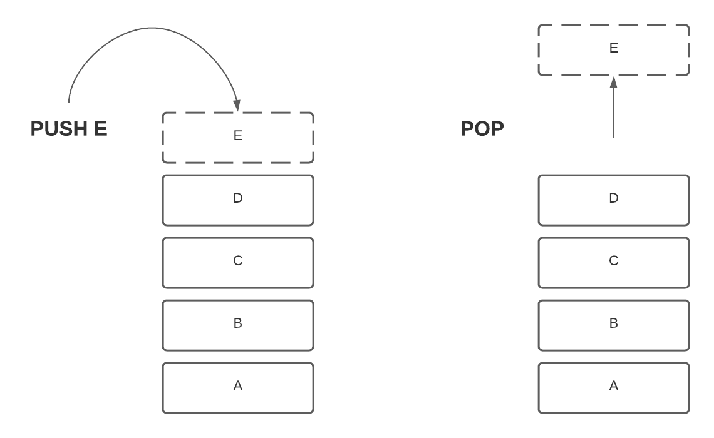

# Summary
简单了解一下EVM

# 什么是EVM
以太坊虚拟机，简称`EVM`，是以太坊背后的大脑。顾名思义，它是一个计算引擎，类似于 `Microsoft .NET Framework` 中的虚拟机或其他字节码编译的编程语言（如 Java）的解释器。

`EVM` 是以太坊协议的一部分，用于控制智能合约的部署和执行。它可以与具有数百万个可执行事物（合约）的全球分散计算机进行比较，每个事物都有自己的永久数据存储。

当部署智能合约时，每个节点都会收到它的副本，运行其字节码并将代码提供给调用部署的任何人，从而导致“状态更改”。这意味着区块链的当前状态已被改变，这只有在每个节点达成共识的情况下才能完成。因此，EVM 通常被称为“分布式状态机”。它跟踪区块链随着每笔交易而变化的状态。

# 堆栈

EVM是最为堆栈运行，深度为1024 `items`，每个`items`有`256 bit(32 bytes)`，选择这样运行的原因是因为这样可以和`256`位的加密所兼容。由于EVM是堆栈的，所以也就是后进先出。

`Opcode`通常使用堆栈元素作为输入，始终采用顶部（最近添加的）元素。

# Memory and Calldata
在 `EVM` 中，`Memory`可以被视为可扩展的、字节寻址的一维数组。它一开始是空的，读取、写入和扩展它都需要花费`gas`。另一方面，`Calldata` 非常相似，但它不能扩展或覆盖。它包含在交易的有效负载中，并充当合约调用的输入。
256 bit load & store:
- 从内存或 calldata 读取将始终访问给定指针后的前 256 位（32 字节或 1 个字）。
- 存储到内存将始终将字节写入给定指针后的前 256 位（32 字节或 1 个字）。

内存和调用数据不是持久性的，它们是易失性的——事务执行完成后，它们就会被遗忘。

# Storage
以太坊上的所有合约账户都能够将数据持久存储在键值存储中。合约存储的读写成本比内存高得多，因为交易执行后，所有以太坊节点都必须相应地更新合约的存储树。

# Refer
https://learn.bybit.com/deep-dive/what-is-ethereum-virtual-machine-evm/?ref=zaryabs.com