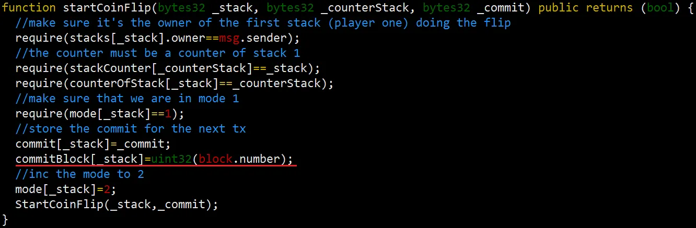

# 7.WeakRandomnes

Weak PRNG due to a modulo on block.timestamp , now or blickhash.

These can be infulences by miners to some extent so they shoude be avoided.

Many Dapp are using Randomness , such as NFT , GameFi.

But due to everything on BlockChain are public and deterministic . Solidity does not have function to generate RandomNumbers. So many Developers are using some hash function to generate RandomNumbers like blockhash() and keccak256().

# Examples

## E-1

### Code

```solidity
 contract BadRandomness is ERC721 {
    uint256 totalSupply;

    // 构造函数，初始化NFT合集的名称、代号
    constructor() ERC721("", ""){}

    // 铸造函数：当输入的 luckyNumber 等于随机数时才能mint
    function luckyMint(uint256 luckyNumber) external {
        uint256 randomNumber = uint256(keccak256(abi.encodePacked(blockhash(block.number - 1), block.timestamp))) % 100; // get bad random number
        require(randomNumber == luckyNumber, "Better luck next time!");

        _mint(msg.sender, totalSupply); // mint
        totalSupply++;
    }
}
```

### Observation

with quickly look , we can find the luckMint() take a number as the argument ，if `randomNumber == luckyNumber`  , users can mint `NFT`.

Because it use `blockhash` and `block.timestamp` . Attacker can easily guess the LuckNumber.

### Attack

```solidity
contract Attack {
    function attackMint(BadRandomness nftAddr) external {
        // Prev calculate
        uint256 luckyNumber = uint256(
            keccak256(abi.encodePacked(blockhash(block.number - 1), block.timestamp))
        ) % 100;
        // Attack
        nftAddr.luckyMint(luckyNumber);
    }
}
```

## E-2 TimeManipulation

The block timestamp is a uint64 value contained in the Ethereum block header, representing the UTC timestamp (in seconds) when the block was created. Before The Merge, Ethereum adjusted block difficulty based on computing power, so the block time was variable, averaging 14.5 seconds per block, and miners could manipulate the block time. After The Merge, the interval was changed to a fixed 12 seconds per block, and validators were no longer able to manipulate the block time.

In Solidity, developers can access the current block's timestamp by using the global variable `block.timestamp`, which is a uint256 type.

### Code

```solidity
contract TimeMnipulation is ERC721 {
    uint256 totalSupply;

    // 构造函数，初始化NFT合集的名称、代号
    constructor() ERC721("", ""){}

    // 铸造函数：当区块时间能被7整除时才能mint成功
    function luckyMint() external returns(bool success){
        if(block.timestamp % 170 == 0){
            _mint(msg.sender, totalSupply); // mint
            totalSupply++;
            success = true;
        }else{
            success = false;
        }
    }
}
```

## E-3

```solidity
function randomNumber() public view returns (uint) {
    return uint(keccak256(abi.encodePacked(block.difficulty))) % 10;
}
```

## E-4 Real Attack on Cryptogs

[Cryptogs](https://cryptogs.io/) is the game of pogs on the Ethereum blockchain. It is a kind of game of slap-match. This game generates random numbers using `blockhash(uint blockNumber)` to decide the winner. In Solidity, `blockhash(uint blockNumber)` function returns ‘0’ when `blockNumber` is older than 256 blocks from the current block(`block.number`). Cryptogs doesn’t check the `blockNumber` whether it is too old or not, so attackers can predict the random numbers and always win.

Code：

There are two functions generating random numbers: `endCoinFlip()` and `throwSlammer()`. Both functions required preliminary functions: `startCoinFlip()` and `raiseSlammer()`.

First, let’s check `startCoinFlip()` and `endCoinFlip()`. The two functions decide who goes first.



[Attack on Pseudo-random number generator(PRNG) used in Cryptogs, an Ethereum (CVE-2018–14715)](https://medium.com/coinmonks/attack-on-pseudo-random-number-generator-prng-used-in-cryptogs-an-ethereum-cve-2018-14715-f63a51ac2eb9)

## E-6 Ethernaut::CoinFlip

```solidity
// SPDX-License-Identifier: MIT
pragma solidity ^0.8.0;

contract CoinFlip {

  uint256 public consecutiveWins;
  uint256 lastHash;
  uint256 FACTOR = 57896044618658097711785492504343953926634992332820282019728792003956564819968;

  constructor() {
    consecutiveWins = 0;
  }

  function flip(bool _guess) public returns (bool) {
    uint256 blockValue = uint256(blockhash(block.number - 1));

    if (lastHash == blockValue) {
      revert();
    }

    lastHash = blockValue;
    uint256 coinFlip = blockValue / FACTOR;
    bool side = coinFlip == 1 ? true : false;

    if (side == _guess) {
      consecutiveWins++;
      return true;
    } else {
      consecutiveWins = 0;
      return false;
    }
  }
}
```

我们只需要实现和CoinFlip中一样的逻辑就可以了，因为在整个过程都发生在一个tx中所以 `block.hash` 和 `block.number` 是相同的。

# Mitigation

- 我们通常使用预言机项目提供的链下随机数来预防这类漏洞。
- 在合并（The Merge）之前，以太坊矿工可以操纵区块时间，如果抽奖合约的伪随机数依赖于区块时间，则可能被攻击。合并之后，以太坊改为固定 12s 一个区块，并且验证节点不能操纵区块时间。因此这类攻击不会在以太坊上发生，但仍可能在其他公链中遇到。
- 1. Utilize decentralized randomness beacons like Chainlink’s VRF.